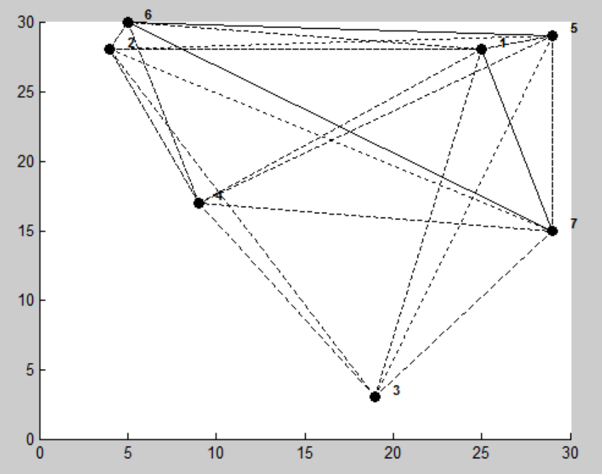
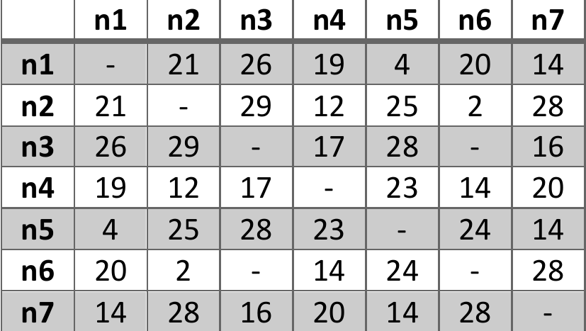
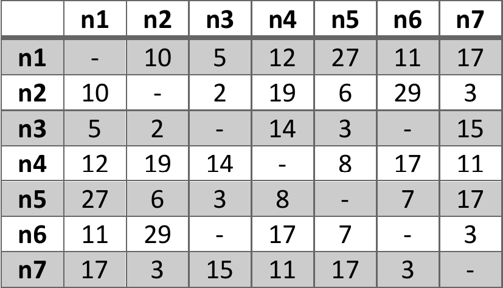
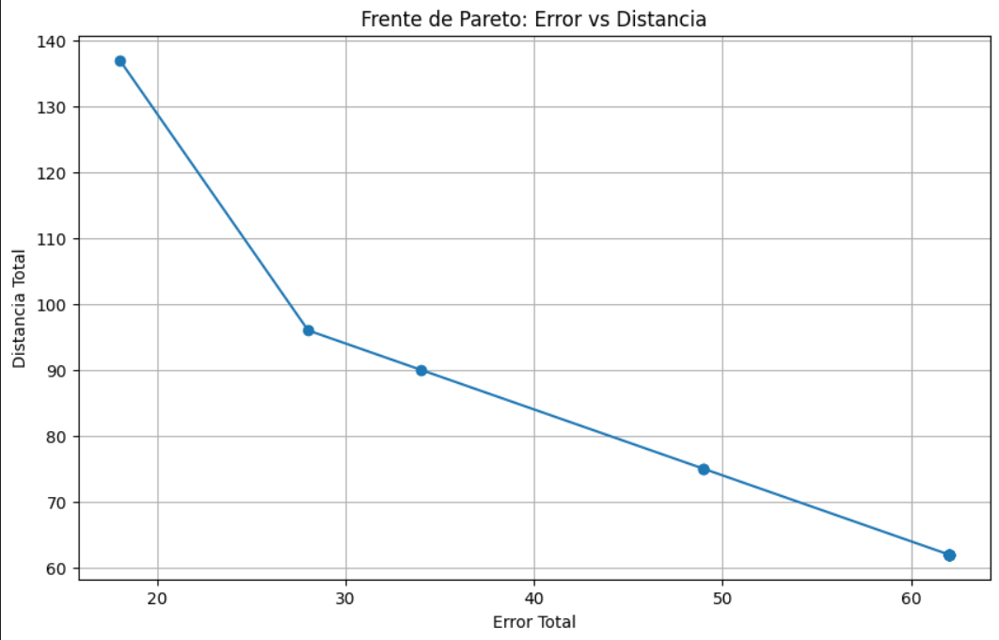

# Multi-Objective Routing in IoT Sensor Networks

## Overview
This repository presents a multi-objective optimization model aimed at finding two minimum-cost paths in an IoT-based sensor network. The model seeks to minimize both the total distance and the total bit error rate (BER) from a source node to a destination node, ensuring robust and reliable communication even if one path fails.

## Problem Description

In this scenario, we have an IoT network composed of sensor nodes. The objective is to send data from a source node (node 3) to a destination node (node 6) through intermediate nodes. The optimization problem involves two cost metrics:

1. **Distance (Dij):**  
   A shorter distance leads to better network performance, as it generally reduces delays and potential interference.

2. **Bit Error Rate (Eij):**  
   A lower bit error rate for a given link improves the reliability of data transmission, ensuring fewer packet losses and retransmissions.

**Key Requirement:**  
We need not just one, but two distinct minimal-cost paths to increase fault tolerance. If one path fails, the other can still deliver data.

### Illustrations of the Problem
- **Network Graph (Nodes and Edges):**  
  

- **Distance Cost Matrix:**  
  

- **Error Rate Matrix (BER):**  
  

## Mathematical Model

### Sets

- $N = \{1, 2, 3, 4, 5, 6, 7\}$: Set of nodes.
- $P = \{1, 2\}$: Set of paths to be found.

### Parameters

- $D_{ij}$: Distance between node $i$ and $j$, $\forall i, j \in N$.
- $E_{ij}$: Bit error rate between node $i$ and $j$, $\forall i, j \in N$.

**Note:** If there is no direct connection between $i$ and $j$, $D_{ij} = \infty$ or $E_{ij} = \infty$.

### Decision Variables

- $x_{ijk} \in \{0, 1\}$: Binary variable indicating if the edge $(i, j)$ is used in path $k$, for all $i, j \in N$ and $k \in P$.

### Objective Functions

We have a multi-objective optimization problem with two objectives:

1. **Minimize Total Distance:**

   $$
   \min \sum_{i \in N} \sum_{j \in N} \sum_{k \in P} D_{ij} \cdot x_{ijk}
   $$

2. **Minimize Total Error:**

   $$
   \min \sum_{i \in N} \sum_{j \in N} \sum_{k \in P} E_{ij} \cdot x_{ijk}
   $$

### Constraints

1. **No edge overlap among paths:**

   $$
   \sum_{k \in P} x_{ijk} \leq 1 \quad \forall i, j \in N
   $$

2. **Flow conservation (except at the destination):**

   $$
   \sum_{j \in N} x_{jik} \leq \sum_{j \in N} x_{ijk} \quad \forall k \in P, \forall i \in N \setminus \{6\}
   $$

3. **At most one outgoing edge per node and path:**

   $$
   \sum_{j \in N} x_{ijk} \leq 1 \quad \forall k \in P, \forall i \in N
   $$

4. **At most one incoming edge per node and path:**

   $$
   \sum_{j \in N} x_{jik} \leq 1 \quad \forall k \in P, \forall i \in N
   $$

5. **Exactly one outgoing connection from the source node (node 3) per path:**

   $$
   \sum_{j \in N} x_{3jk} = 1 \quad \forall k \in P
   $$

6. **Exactly one incoming connection to the destination node (node 6) per path:**

   $$
   \sum_{j \in N} x_{j6k} = 1 \quad \forall k \in P
   $$

7. **No incoming connections to the source node (node 3):**

   $$
   \sum_{j \in N} x_{j3k} = 0 \quad \forall k \in P
   $$

8. **No outgoing connections from the destination node (node 6):**

   $$
   \sum_{j \in N} x_{6jk} = 0 \quad \forall k \in P
   $$

## Pareto Frontier Visualization
To understand the trade-offs between minimizing distance and minimizing error, we introduce an Epsilon parameter to constrain one objective while optimizing the other. By varying Epsilon, we obtain different solutions that form a Pareto frontier.

## Solutions for Different Epsilon Values
Below are the solutions found for various Epsilon values. Each solution shows the total distance, total error, and the two paths found. If no feasible solution is found for a given Epsilon, it is stated accordingly.

**Epsilon: 10**  
No feasible solution found.

---

**Epsilon: 20**  
- Total Distance: 137  
- Total Error: 18

**Path 1:** 3 -> 5 -> 6  
- Path 1 Distance: 52  
- Path 1 Error: 10

**Path 2:** 3 -> 2 -> 7 -> 6  
- Path 2 Distance: 85  
- Path 2 Error: 8

---

**Epsilon: 30**  
- Total Distance: 96  
- Total Error: 28

**Path 1:** 3 -> 7 -> 6  
- Path 1 Distance: 44  
- Path 1 Error: 18

**Path 2:** 3 -> 5 -> 6  
- Path 2 Distance: 52  
- Path 2 Error: 10

---

**Epsilon: 40**  
- Total Distance: 90  
- Total Error: 34

**Path 1:** 3 -> 1 -> 6  
- Path 1 Distance: 46  
- Path 1 Error: 16

**Path 2:** 3 -> 7 -> 6  
- Path 2 Distance: 44  
- Path 2 Error: 18

---

**Epsilon: 50**  
- Total Distance: 75  
- Total Error: 49

**Path 1:** 3 -> 7 -> 6  
- Path 1 Distance: 44  
- Path 1 Error: 18

**Path 2:** 3 -> 4 -> 6  
- Path 2 Distance: 31  
- Path 2 Error: 31

---

**Epsilon: 60**  
- Total Distance: 75  
- Total Error: 49

**Path 1:** 3 -> 7 -> 6  
- Path 1 Distance: 44  
- Path 1 Error: 18

**Path 2:** 3 -> 2 -> 6  
- Path 2 Distance: 31  
- Path 2 Error: 31

---

**Epsilon: 70**  
- Total Distance: 62  
- Total Error: 62

**Path 1:** 3 -> 4 -> 6  
- Path 1 Distance: 31  
- Path 1 Error: 31

**Path 2:** 3 -> 2 -> 6  
- Path 2 Distance: 31  
- Path 2 Error: 31

---

**Epsilon: 80**  
- Total Distance: 62  
- Total Error: 62

**Path 1:** 3 -> 4 -> 6  
- Path 1 Distance: 31  
- Path 1 Error: 31

**Path 2:** 3 -> 2 -> 6  
- Path 2 Distance: 31  
- Path 2 Error: 31

*(The solutions for Epsilon = 90, 100, 110, ... 200 are identical to Epsilon = 80. They all result in the same total distance, total error, and paths.)*

**Epsilon: 90, 100, 110, ... , 200**  
- Total Distance: 62  
- Total Error: 62

**Path 1:** 3 -> 4 -> 6  
- Path 1 Distance: 31  
- Path 1 Error: 31

**Path 2:** 3 -> 2 -> 6  
- Path 2 Distance: 31  
- Path 2 Error: 31

---